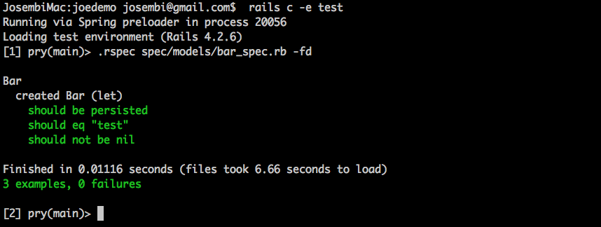
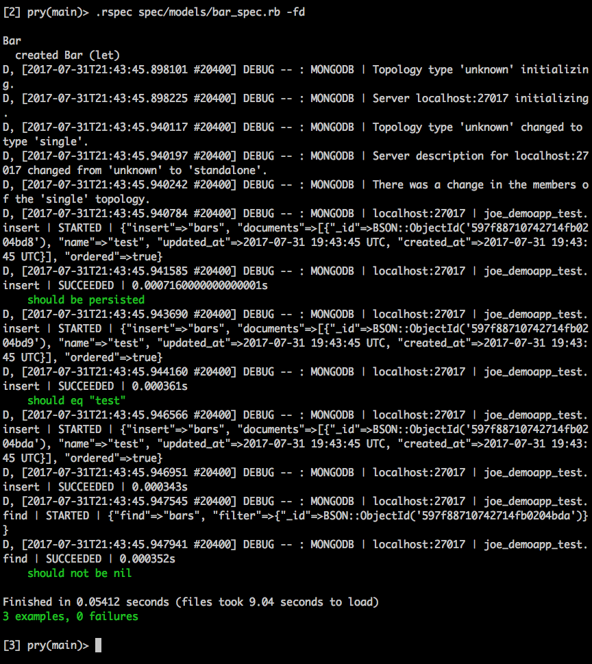
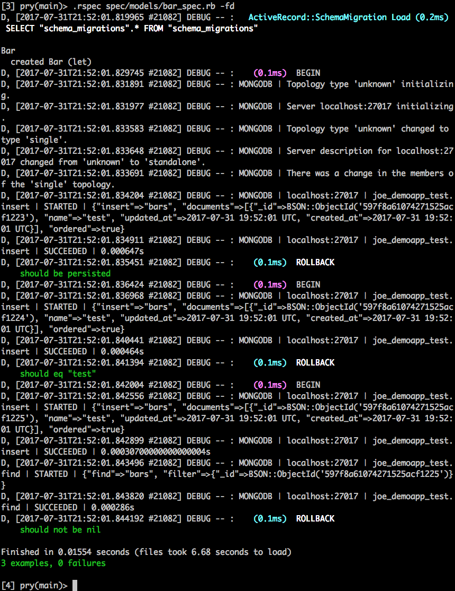
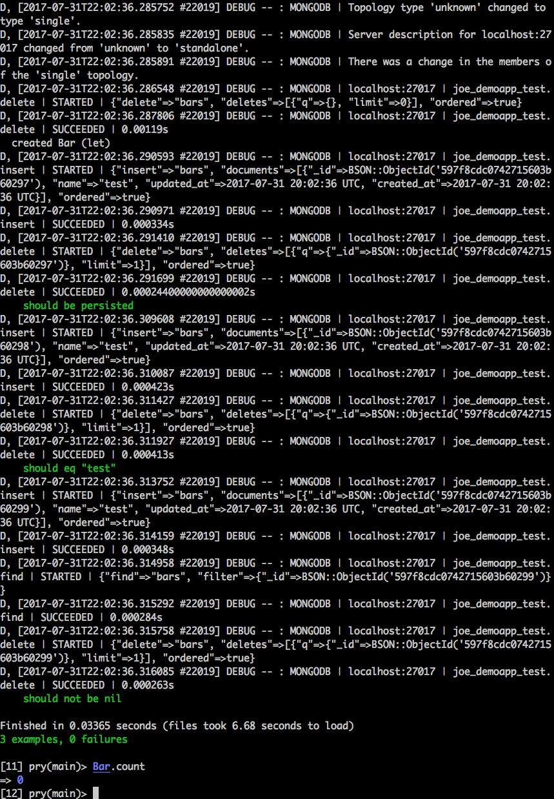
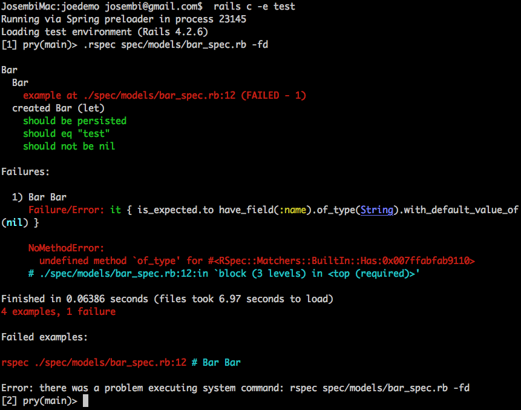
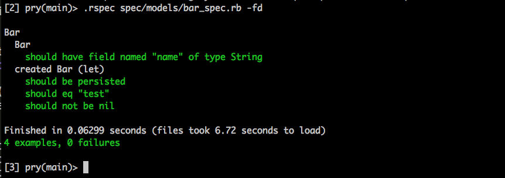
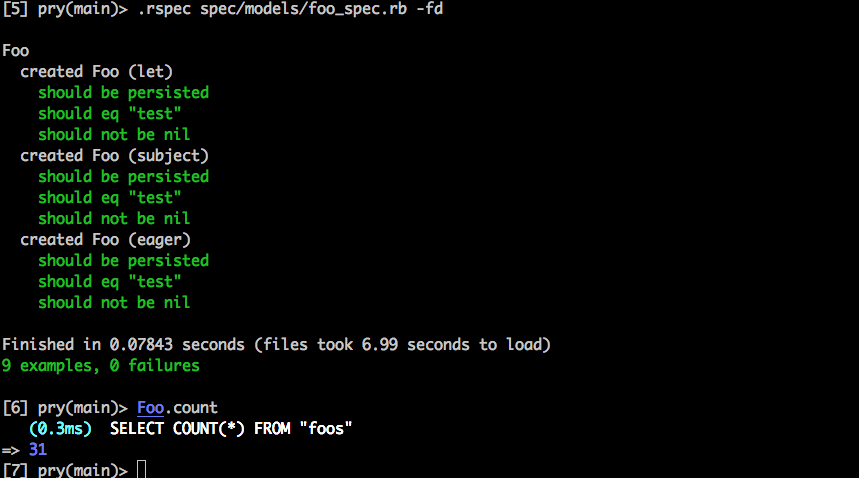
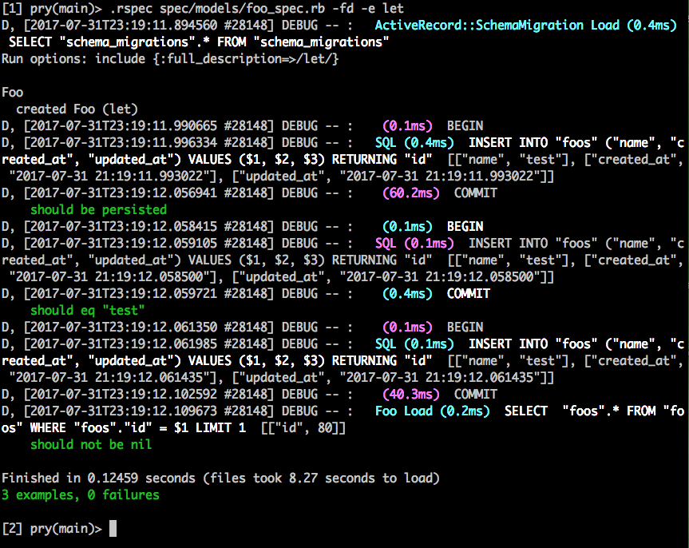
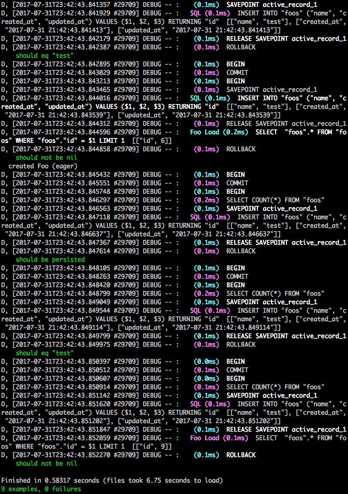
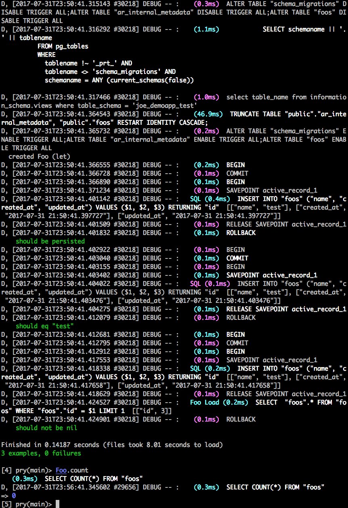

# Module 3

## Introduction

This module is tailored on testing. I'll dwell precisely on what to test, how to test and the gotchas of testing. I'll be using tools like RSpec which is a DSL (Domain Specific Language) for testing. I'll use both Unit and Integration testing. Because I'll be dealing with DB's, I'll bring in a DB Cleaner to give me some transactional and truncation DB cleanup strategies.

As I progress, I'll bring in Factory Girl (FG) which is a fixtures replacement with a straightforward definition syntax. FG supports multiple build strategies (saved instances, unsaved instances, attribute hashes, stubbed objects) and multiple factories for the same class (user, admin_user, and so on), including factory inheritance.

I'll also bring in Faker Gem which is quite handy in generating simulated data. I'll treat my test code as if it were production and thus will refactor and DRY it as much as possible. I'll leverage RSpecs, shared context, and shared examples, where I'll build abstract test artefacts and plug them into concrete test box. I'll also leverage Ruby Modules, to build helper methods around some complex application interactions, like login and logout, that I don't want to repeat everywhere.

My specific types are going to be model, request, and feature specs. With model specs I'm going to focus on query scopes, facade methods, and relationships. I won't be testing Active Record and Mongoid as I did that in Module 1. I want to keep things very concise without revealing much what to expect or do in the next modules as the instructor advised. By the way in the previous classes we had some students experiment with different Front-end technologies like ReactJS, Ember, etc and you are free to do so. The grading projects and exercises however are tailored on AngularJS.

Later on, I'll evaluate the APIs for its functionality and the payload concepts before I start building the UI on top of it. With feature specs I'll use Capybara to test the web UI and bring in two drivers to do that, Selenium and PhantomJS with the [Poltergeist](https://rubygems.org/gems/poltergeist/versions/1.10.0) gem.

Selenium is a good choice for authoring, as it creates an amazing interaction with the browser, keystrokes, button clicks, fields being filled in, etc. Poltergeist and PhantomJS have a nice headless solution, which are great for regression testing and for stuff that I have finished and I want to make sure that I haven't broken. For those who intend to fork/download this repo from my GitHub page and use it as a tutorial, it's important to note, that testing asynchronous applications like the Web UI is a very complex thing to do. It's going to take a good bit of knowledge and good decisions in order to come out with deterministic results.

## RSpec DSL

As I continue building, I would like to reiterate that concepts that I explained in the two previous modules will be lightly touched and I will try as much as  possible not to deviate (shortcuts or boilerplates) but to stick to what is at hand.

I'll be going through the following concepts;
  - RSpec
  - DSL
    * expressive
  - Examples
  - Example Groups
  - Spec Types
  - Matchers
  - Setup
  - Generators

I'll start by generating a new rails test app via a scaffold, skipping the rails test units (-T) as I'll be using RSpec as a DSL.  

Below is short demo of RSpec test showing what DSL means for a Foo object. Name of the test (Foo) expressed as a class and a hash which can express the type of test. Any metadata for instance if ORM is active_model can be used to tag your test.

```ruby
require 'rails_helper'

describe Foo, type: :model :orm=>:active_model do

end
```

Nested example groups can also be designated and can also carry metadata.

```ruby
require 'rails_helper'

describe Foo, type: :model do

  describe Foo do
  end

end
```

See below for a very expressive, domain-specific language.

```ruby
require 'rails_helper'
#require 'spec_helper'

describe Foo, type: :model do

  context "valid foo" do
    it "has a name"
    foo=Foo.create(:name=>"test")
    expect(foo).to be_valid
    expect(foo.name).to_not be_nil
    end
end
```

Taking a closer peek, you can see all these are just class constructs crafted for the domain of testing.

```ruby
#require 'rails_helper'
require 'spec_helper'
RSpec.describe Foo, type: :model do

  self.context "valid foo" do
    self.it "has a name"
    foo=Foo.create(:name=>"test")
    self.expect(foo).to self.be_valid
    self.expect(foo.name).to_not self.be_nil
    end
end
```

## Spec Anatomy Part 1: DB Interaction and Blocks

I'll be going through DB interactions and Common Logic (before/after blocks and let blocks). This is a sorta enabled/disabled console debug. I'll show a few DRYing examples and how to pass attributes for sharing access, :all and :each scope.

It's possible to use the console with a pretty print out like Pry for the code to display in an "eye pleasing" way. Basically as far as the DB interaction is concerned, this can be achieved by configuring specs in the spec helper. It's possible to configure Rails helper files within the models and that would actually give us the DB interactions in the console. Pretty straight forward so wont dwell much on that. (*Hint; before and after blocks*)

## Spec Anatomy Part 2: Thinning Examples

The reason as to why you may want to thin your blocks is to break down compound tests into isolated tests to better express the requirements and the ability to meet those requirements.

For instance, the code below would cause an error;

```ruby
require 'rails_helper'

describe Foo, type: :model do

  it "created Foo will be persisted, have a name, and be found" do
    @foo=Foo.create(:name => "test");
    expect(@foo).to_not be_persisted  #Causing error
    expect(@foo.name).to eq("test")
    expect(Foo.find(@foo.id)).to_not be_nil
  end
end
```

To initialise the error solution, I may want to involve some techniques, and one of them is separating the blocks. See below.

```ruby
require 'rails_helper'

describe Foo, type: :model do

  context "created Foo" do
    let(:foo) { Foo.create(:name => "test")}

    it "created Foo will be persisted" do
      expect(@foo).to_not be_persisted  #Causing error
    end

      it "have a name" do
      expect(@foo.name).to eq("test")
    end

      it "be found" do
      expect(Foo.find(@foo.id)).to_not be_nil
    end
  end
end
```

The code above will run the transactions and if they adhere to the tests, they wil be inserted in the DB otherwise a rollback will happen. (*Run rspec in console and see the isolations*)

The matcher is very powerful in expressing the test status. (*Turning off debug and running the test would create a Foo object and flag that it shouldn't be persisted*), see below. Implement it to your liking and run rspec in the console.

```ruby
require 'rails_helper'

describe Foo, type: :model do

  context "created Foo" do
    let(:foo) { Foo.create(:name => "test")}

    it { expect(foo).to_not be_persisted }
    it { expect(foo.name).to eq()"test" }
    it { expect(Foo.find(foo.id)).to_not be_nil }
  end
end
```

The best thing with these custom matchers is that they kick out the right information when rspec is executed. The code is mostly a one liner for every block which is apparently DRY.

## Spec Anatomy Part 3: Pending Examples and Lazy/Eager Let Blocks

I will briefly go through blocks which may be Lazily instantiated or Eagerly instantiated (**Lazy/Eager let blocks**).

This is an area that took me a while to grasp properly, tests ran OK but if you have a better approach, let me know. Here go the blocks that I referenced accordingly as lazy, subject and let.

```ruby
require 'rails_helper'


describe Foo, type: :model do

  context "created Foo (let)" do
    let(:foo) { Foo.create(:name => "test") }

  it { expect(foo).to be_persistent }
  it { expect(foo.name).to eq("test") }
  it { expect(Foo.find(foo.id)).to_not be_nil }
  end

  context "created Foo (subject)" do
    let(:foo) { Foo.create(:name => "test") }

  it { expect(foo).to be_persistent }
  it { expect(foo.name).to eq("test") }
  it { expect(Foo.find(foo.id)).to_not be_nil }
  end

  context "created Foo (lazy)" do
    let(:before_count) { Foo.count }
    let(:foo)          { Foo.create(:name => "test") }

  it { expect(foo).to be_persistent }
  it { expect(foo.name).to eq("test") }
  it { expect(Foo.find(foo.id)).to_not be_nil }
  it { expect(Foo.count).to eq(before_count + 1) }
  end
end
```

If I run rspec, the lazy block fails because it's within the bounds of this test as Foo was never referenced and before_count is referenced rather late.

This can fixed by adding a pending state (**xit**) to the block and skip it. Adding **pending** on the block can also do the charm.
```ruby
pending  it { expect(Foo.count).to eq(before_count + 1) }
```

Overal Fix is introduction of a bang in before_count and a function to call the let construct. See the block below.

```ruby

  context "created Foo (lazy)" do
    let(:before_count) { Foo.count }
    let!(:foo)          { Foo.create(:name => "test") } #introducing bang

  it { expect(foo).to be_persistent }
  it { expect(foo.name).to eq("test") }
  it { expect(Foo.find(foo.id)).to_not be_nil }
  it { foo;expect(Foo.count).to eq(before_count + 1) } # foo function introduction
  end
```

So in a nutshell, let blocks are lazily instantiated blocks that don't get executed until they are called and their blocks only get executed once and cached between calls.

## RSpec with Mongoid

I'll be taking a closer look at;
  - Mongoid model tests
  - Enabling Mongo database debug
  - Database cleanup
  - Custom matchers: Mongoid-rspec
  - Configuring examples through metadata

As I cruise through mongo, I'll add some extra details as I've realised many people are getting stuck on mongo DB tests and even having trouble hooking up the actual DB. People curse and give bad names to mongo but the rule of thumb is; "if it's not working, you are doing something wrong".

I'll write some minor tests using Bar then I'll log in my rails console and poke things around. Firstly, I'll run rspec in fd mode just to make sure that everything parses.

```ruby
Below is my **bar_spec.rb**

require 'rails_helper'

describe Bar, type: :model do

   context "created Foo (let)" do
    let(:bar)  { Bar.create(:name => "test") }

  it { expect(bar).to be_persisted }
  it { expect(bar.name).to eq("test") }
  it { expect(Bar.find(bar.id)).to_not be_nil }
  end

end
```


<hr>

Next, I'll add a debugger and turn on the Mongo Logger, then run RSpec once again. I expect the test to run successfully and an insertion to the DB with no removal as there is no transaction (Mongo doesn't use transactions like Rails).

```ruby
require 'rails_helper'

require 'mongo'
Mongo::Logger.logger.level = ::Logger::DEBUG

describe Bar, type: :model do

   context "created Bar (let)" do
    let(:bar)  { Bar.create(:name => "test") }

  it { expect(bar).to be_persisted }
  it { expect(bar.name).to eq("test") }
  it { expect(Bar.find(bar.id)).to_not be_nil }
  end

end
```


<hr>

Supposing I turn on Rails logger (**Rails.logger = Logger.new(STDOUT)**) in config and re-run the test again, you'll notice there was a transaction BEGIN and a ROLLBACK with a mongo insert in the middle. Three transactions to be precise, which is meaningless as mongo doesn't use that. I'll turn off rails logger.


<hr>

I can choose to delete data created in single test run within the DB after the test is done;

```ruby
require 'rails_helper'

require 'mongo'
Mongo::Logger.logger.level = ::Logger::DEBUG

describe Bar, type: :model do

   context "created Bar (let)" do
    let(:bar)  { Bar.create(:name => "test") }
    after(:each) do
    bar.delete
    end
  it { expect(bar).to be_persisted }
  it { expect(bar.name).to eq("test") }
  it { expect(Bar.find(bar.id)).to_not be_nil }
  end

end
```

I can choose to do a DB Cleanup after I run a test;

```ruby
require 'rails_helper'

require 'mongo'
Mongo::Logger.logger.level = ::Logger::DEBUG

describe Bar, type: :model do
  before(:all) do
    Bar.delete_all
  end

   context "created Bar (let)" do
    let(:bar)  { Bar.create(:name => "test") }

    after(:each) do
    bar.delete
    end

  it { expect(bar).to be_persisted }
  it { expect(bar.name).to eq("test") }
  it { expect(Bar.find(bar.id)).to_not be_nil }
  end

end
```


<hr>

Next thing I'll do is pull up a gem matcher known as **[mongoid-rspec](https://github.com/mongoid-rspec/mongoid-rspec)**. I'll add some test descriptions of Bar, turn off debug and run it. Runnning this will throw (No method) errors. The gem is in, it's bundled but it's yet unknown to the application.


<hr>

So I'll just break the ice and make the gem known by including it to the class. The whole code should be like this;

```ruby
require 'rails_helper'

require 'mongo'
Mongo::Logger.logger.level = ::Logger::INFO

describe Bar, type: :model do
  include Mongoid::Matchers

  before(:all) do
    Bar.delete_all
  end

  context Bar do
    it { is_expected.to have_field(:name).of_type(String).with_default_value_of(nil) }
  end

   context "created Bar (let)" do
    let(:bar)  { Bar.create(:name => "test") }

    after(:each) do
    bar.delete
    end

  it { expect(bar).to be_persisted }
  it { expect(bar.name).to eq("test") }
  it { expect(Bar.find(bar.id)).to_not be_nil }
  end

end
```

The test parses with a field named "name" of type "string".


<hr>

Another way to solve this is using an example group in config, but I don't feel going down that road as this documentation may get too verbose.  Anyone willing to get the nitty gritty of MongoDB can google these concepts [Ruby on Rails Web Services and Integration with MongoDB](https://github.com/appwebtech/Ruby_on_Rails_Certification/tree/master/3_Ruby_on_Rails_Web_Services_and_Integration_with_MongoDB) or check some tutorials on YouTube.

## DB Cleaner with ActiveRecord

DB's can really get complicated especially when data starts to grow. Because Mongo is a NoSQL DB which is ideal for Bigdata, I'll go through **DB Cleaner** where I'll concentrate on;
  - Automation (data removal within the DB)
  - Getting DB to a known state.

### Main Concepts

* Establish Strategy
  * :transaction
  * :truncation
```ruby
        DatabaseCleaner[:active:record].strategy = :transaction
        DatabaseCleaner[:mondoid].strategy = :truncation
```
* Call start before making changes
```ruby
        DatabaseCleaner.start
```
* Call clean after thru making changes
```ruby
        DatabaseCleaner.clean
```
* Call clean_with(:truncation)anytime just to clear everything
```ruby
        DatabaseCleaner.clean_with(:truncation)
```

To make my coding easier, I'll add the **database_cleaner** gem in the root of my application as I will get back to it later and run bundle. Next within my rails helper file, I'll turn off the transactional support to false. (*config.use_transactional_fixtures = false*) The reason for this is to kill Rails from managing the transactions and allow full control of the DB Cleaner.

If I run RSpec targeting Foo, everything parses but when I do Foo.count, you'll realise I have some leakages due to turned off transactions.


<hr>

If I turn on transactions (**Rails.logger = Logger.new(STDOUT)**) and I run maybe only one of them, you'll notice there is a BEGIN and a COMMIT as the data is inserted with no ROLLBACK.


<hr>

I'll add the DB Cleaner within my Foo spec and run the test in fd.

```ruby
require 'rails_helper'
require 'database_cleaner'

describe Foo, type: :model do
    before(:all) do
      DatabaseCleaner[:active_record].strategy = :transaction
      DatabaseCleaner.clean_with(:truncation)
    end
=begin
    after(:all) do
      DatabaseCleaner.clean_with(:truncation)
    end
=end
    before(:each) do
      DatabaseCleaner.start
    end
    after(:each) do
      DatabaseCleaner.clean
    end

  context "created Foo (let)" do
    let(:foo) { Foo.create(:name => "test")}

    it { expect(foo).to be_persisted }
    it { expect(foo.name).to eq("test") }
    it { expect(Foo.find(foo.id)).to_not be_nil }
  end

  context "created Foo (subject)" do
    subject { Foo.create(:name => "test") }

    it { is_expected.to be_persisted }
    it { expect(subject.name).to eq("test") }
    it { expect(Foo.find(subject.id)).to_not be_nil }
  end

  context "created Foo (eager)" do
    let!(:before_count) { Foo.count }
    let(:foo)   { Foo.create(:name => "test") }

    it { expect(foo).to be_persisted }
    it { expect(foo.name).to eq("test") }
    it { expect(Foo.find(foo.id)).to_not be_nil }
  # it { expect(Foo.count).to eq(before_count + 1) }
  end
end
```

Now I can verify that the DB is clear of any trash. The test parses without  leakages.


<hr>


I'll try to run a single test. Notice how PG was queried to see what tables are within the DB? It then went ahead and did a truncation; then DB Cleaner took over and started making COMMITs doing INSERTs and ROLLingBACK.


<hr>

So in essence, I've tried to demonstrate tacitly (without overwhelming data and code) how DB Cleaner can come in very handy to clean the DB tables. No need to specify tables to be cleaned or whatnot.
